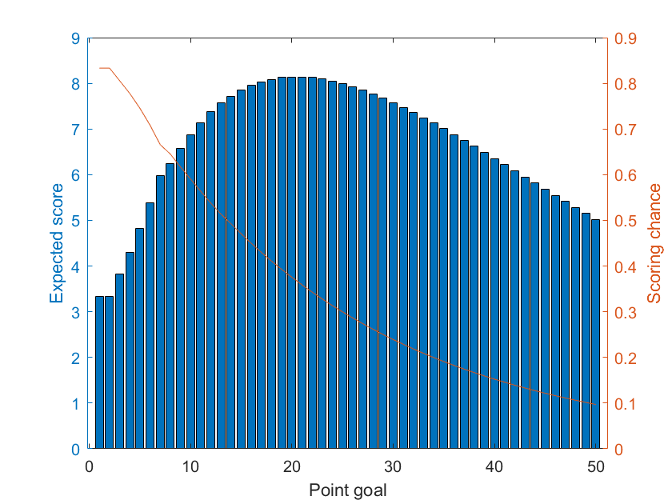

# greedypig
This is inspired by the numerphile video https://www.numberphile.com/videos/the-math-of-being-a-pig.
The function pigMatrix(n) constructs the transition matrix of the Markov chain arising from to the game pig, where the player stops rolling after getting n points.
The script greedypig uses this transition matrix to construct the chart in the video in around 0.2 seconds (much better then a full weekend!).

